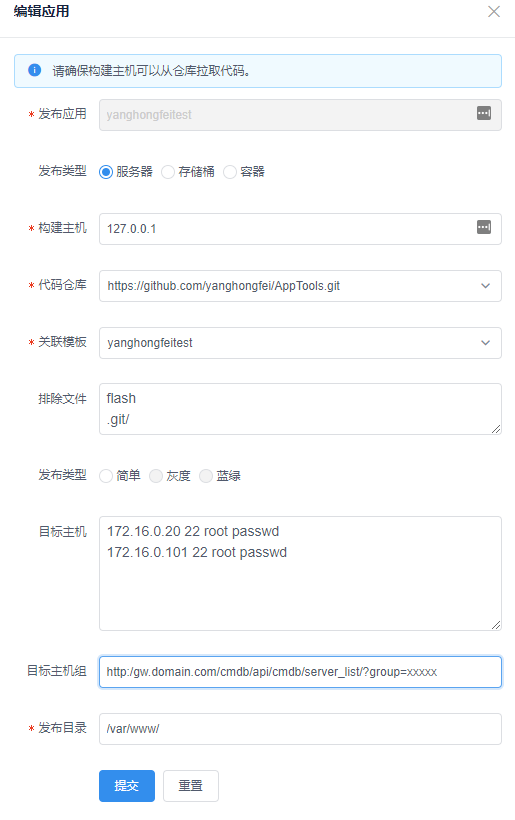

# codo-publish

> codo平台发布示例，支持服务器发布和Bucket发布，只有后端代码逻辑，所有的配置信息都是从前端传过来的。

## Server发布
- `get_publish_info.py`: 获取发布信息写文件
- `pull_code.py`: 构建主机拉取代码
- `bulid_code.py`: 编译代码，如：`npm install`
- `upload_code.py`: 处理exclude过滤后将代码并发到目标主机的`/tmp`目录
- `backup_code.py`: 备份目标主机的代码到：`/tmp/code_backup`，只保留最近一个版本
- `depoly_code.py`: 部署/下发代码到目标主机的代码目录，并发操作
- `custom_operation.py`: 自定义操作，比如下发完代码后需要重启xxx进程， `systemctl restart nginx`

## Bucket发布

- `upload_s3`：上传资源到AWS S3
- `upload_cos`: 上传资源到腾讯云COS
- `upload_oss`: 上传资源到阿里云OSS


## 开始使用
```
##将代码放到/opt/ops_scripts目录下，后续平台要使用到
mkdir -p /opt/ops_scripts
yum install sshpass -y
cd /opt/ops_scripts && git clone https://github.com/opendevops-cn/codo-publish.git
cd codo-publish && pip3 install -r requirements.txt

##修改对应settings里面API网关地址，用户密码信息
vim settings.py
api_gw = 'http://gw.opendevops.cn/api'
```

### 效果图
- 发布应用配置信息
- FLOW_ID : 提交发布生成的ID，平台系统变量自动传入(可无视)
- PUBLISH_NAME： 发布应用名称，平台系统变量自动传入(可无视)
- PUBLISH_TAG： 发布TAG名称，平台系统变量自动传入(可无视)


- 提交发布


- 处理过程

**服务器发布逻辑**


**OSS发布逻辑**


**COS发布逻辑**


**S3发布逻辑**


### 数据类型

- 接口数据类型如下

```json
{
	"id": 1,
	"publish_name": "yanghongfeitest",
	"publish_type": "service",
	"repository": "git@gitlab.domai.comn:ops/yanghongfei.git",
	"build_host": "172.16.0.101",
	"exclude_file": "flash\n.git/",
	"temp_name": "yanghongfeitest",
	"publish_type1": null,
	"publish_path": "/var/www/",
	"publish_hosts": "172.16.0.20 22 root password",
	"publish_hosts_api": "http://gw.domain.com/cmdb/api/cmdb/server_list/?group=xxxx",
	"bucket_type": "oss",
	"region": "",
	"bucket_name": "",
	"bucket_path": "",
	"SecretID": "",
	"SecretKey": "",
	"docker_registry": "",
	"k8s_api": "",
	"namespace": "",
	"create_time": "2018-12-04 16:29:21"
}
```

> PS: 代码写的有点搓，欢迎吐槽！